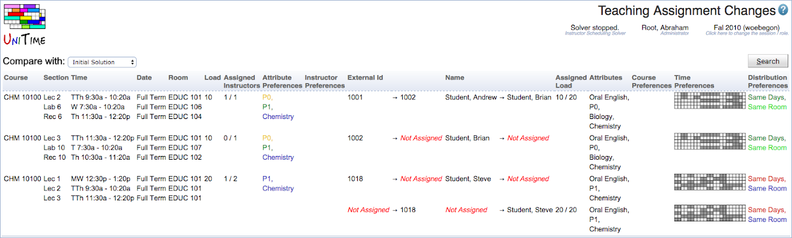

## Screen Description

 The Teaching Assignment Changes page can be used to display changes made by the solver (or manually) when the solver is loaded in memory. The page can compare the teaching assignments of the current solution, with the best solution, initial solution (useful when the solver is used in the MPP mode), or with the data saved in the database.

 The instructor scheduling solver must be loaded in memory for this page to show any data.

## Details

 The table shows the teaching assignments that have been changed between the two solutions. The changes are shown in the format of <selected assignment> → <current assignment>.

 If the current solution has the teaching request assigned (the change shows previous assignment → current assignment or Not Assigned → current assignment), the assigned load, attributes, and course/time/distribution preferences are of the currently assigned instructor. If the current solution has the teaching request not-assigned (the change shows previous assignment → Not Assigned), the assigned load, attributes, and course/time/distribution preferences are of the previously assigned instructor.

## Operations

 Select the solution to compare with and hit the **Search** button.

* **Initial Solution**
	* initial teaching assignments as loaded into the solver (when using MPP mode)

* **Best Solution**
	* teaching assignments of the Best solution

* **Saved Solution**

* teaching assignments as saved in the database

 The table page can be sorted by any column and particular columns can be shown/hidden using the context menu on the table header.

 More details are shown when a particular teaching request is clicked, see [Teaching Request Detail](teaching-request-detail).

{:class='screenshot'}
