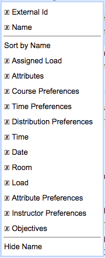

## Screen Description

 Teaching Assignments page shows the same data as the Assigned / Not-Assigned Teaching Requests pages but from the instructor perspective. The page can either show the data as they are assigned in the solver (showing the current solution, when the solver is loaded in memory) or the teaching assignments as they are saved in the database.

## Details

 The table shows the list of instructors that are loaded in the solver or available for teaching assignment (and are from the selected department) together with their current teaching assignments (either taken from the current solution of the solver loaded in memory, or from the database when there is no solver loaded in for the selected department).

 Each line contains the external id and name of an instructor, his/her teaching preference (shown as the color of the instructor external id and name), his/her assigned / maximal teaching load, attributes, course, time and distribution preferences. Time preferences also include unavailabilities that are shown in gray. Teaching assignments are shown with their course, classes, teaching load, attribute and instructor preferences. The impact on the optimization criteria (objectives) are shown in the last column.

## Operations

 The table page can be sorted by any column and particular columns can be shown/hidden using the context menu on the table header. The content of the table can be exported in CSV (comma separated value) or PDF format using the Export CSV or Export PDF buttons respectively. The exported file contains the same columns as they are currently visible on the page and the requests are ordered in the same manner as well.

{:class='screenshot'}

{:class='screenshot'}

 More details are visible when an instructor is clicked, showing the [Teaching Assignment Detail](teaching-assignment-detail) dialog.
