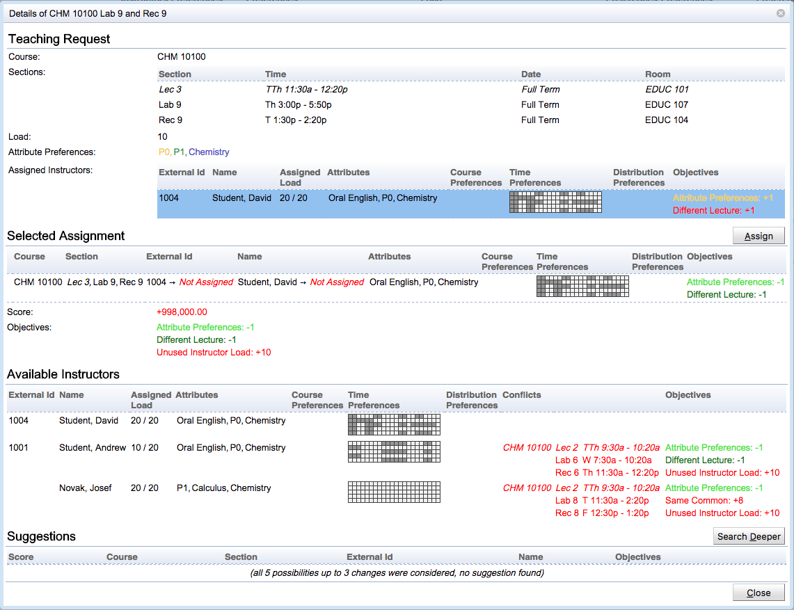

## Screen Description

The Teaching Request Detail dialog is shown when a particular teaching request is clicked (on the [Instructional Offering Detail](instructional-offering-detail) page, [Assigned Teaching Requests](assigned-teaching-requests) page, or [Not-Assigned Teaching Requests](not-assigned-teaching-requests) page). The dialog contains information about the selected teaching request and the assigned instructor(s), if there are any. The dialog also shows other instructors that are available to teach the selected request and their conflicts. These are their current teaching assignments that would have to be unassigned for the instructor to be able to teach the selected request. If the solver is loaded in memory, the dialog also shows a list of solver computed suggestions containing suggestions up to three changes. More suggestions can be computed by searching longer (Search Longer button, when the default search limit is reached during the computation) or by increasing the number of allowed changes (Search Deeper button).

{:class='screenshot'}

## Details

If the teaching request needs two or more instructors, a different instructor assignment can be selected by clicking the appropriate line in the Assigned Instructors table.

The dialog can be used to explore a bigger scenario. When an instructor with a conflict is selected, the conflicting assignments are also listed in the Selected Assignments table and the user can click on one of them to explore other possibilities.

The dialog can switch between teaching request details and instructor details. In the [Teaching Assignment Detail](teaching-assignment-detail) mode, details about the selected instructor and his/her current teaching assignments are displayed. The dialog shows details about the instructor, including a list of times when the instructor is not available because he/she is assigned to a class as an instructor (outside of the instructor scheduling problem that is being solved) or enrolled as a student. The dialog also shows current assignments of the instructor and the related criteria penalizations (objectives). The list of teaching assignments that the instructor can teach is also included.

The dialog can be used to make a change in this mode too, showing the Selected Assignments (if there have been some changes proposed, e.g., by clicking on one of the available teaching assignments) and Suggestions (when the solver is loaded in memory).

## Operations

The dialog offers the following operations:

* Close the dialog without making any changes by clicking Escape or the X button in the top right corner of the dialog, or the **Close** button at the bottom of the page.

* Use the **Assign** button to apply the selected assignment. If the solver is loaded in memory, the change is only made in the solver (in the current solution). When the solver is not running, the change is made directly in the database.

* Click on an instructor to switch the dialog into the Teaching Assignment Detail mode, or on some other teaching request from the Selected Assignment dialog to change the current request.

* Click on an available instructor or on a suggestion to change the Selected Assignment

* Click on **Search Deeper** (the solver will allow for more changes) or **Search Longer** (the solver will take more time to search for suggestions) to see more suggestions
