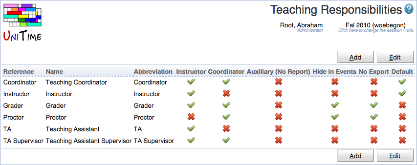
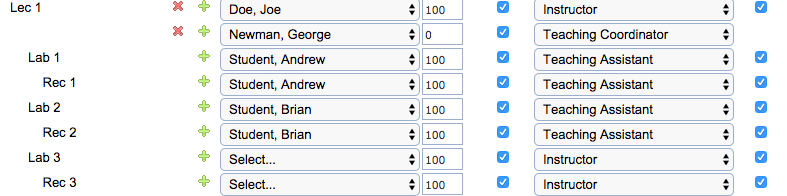

## Screen Description

 The Teaching Responsibilities page allows defining teaching responsibilities. Both instructor and coordinator assignment can have a teaching responsibility defined (optional). This allows, for instance, to distinguish between instructors, teaching assistants, course supervisors, graders, and other roles.

 The teaching responsibilities are independent of academic sessions. The relation between instructor and coordinator assignments and teaching responsibilities are rolled forward together with the instructor/coordinator assignments. The page can be accessed with Teaching Responsibilities permission, modifications can be made with Teaching Responsibility Edit permission.

## Details

 Beside of reference, name, and abbreviation, there is a flag defining whether the responsibility can be used on an instructor (Instructor column), on a coordinator (Coordinator column), whether the assignment should be visible in the reports (Auxiliary), not visible in the event management (Hide in Events) or not exported / sent to an external system (No Export).

 With this change, an instructor can be assigned to a class or to an offering (as a course coordinator) multiple times, but with different responsibilities.

 It is also possible to setup a default teaching responsibility (one for instructors and one for coordinators, see the Default column above), in which case there has to be a teaching responsibility selected for all the new instructor or coordinator assignments.

 When there are one or more teaching responsibilities defined, the Responsibility drop down appears next to the instructor/coordinator assignment.

{:class='screenshot'}

{:class='screenshot'}

 An example of the Responsibility column on the Assign Instructor page.

## Operations

 To edit or delete a teaching responsibility, click on the appropriate line, [Edit Teaching Responsibility](edit-teaching-responsibility) page will appear. All the teaching responsibilities can be edited on the [Edit Teaching Responsibilities](edit-teaching-responsibilities) page. To do so, click on the **Edit** button. Only teaching responsibilities types that are not being used can be deleted.

 A new teaching responsibility type can be added on the [Edit Teaching Responsibilities](edit-teaching-responsibilities) page (button **Edit**) or using [Add Teaching Responsibility](add-teaching-responsibility) page (button **Add**).

 The table can be ordered by any of the columns. To do so, click on the column header and select Sort by <column name> option.
