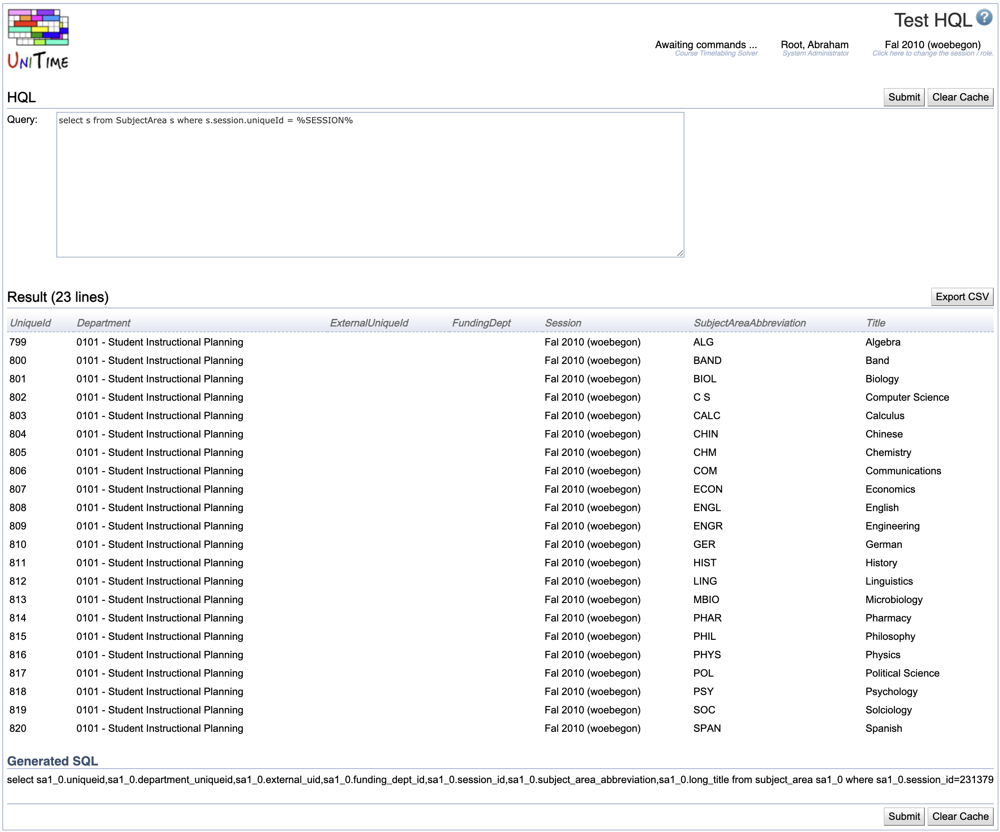

## Screen Description


 The Test HQL screen is a place to enter an [HQL](http://www.hibernate.org/hib_docs/reference/en/html/queryhql.html) query which uses the timetabling database and see the results of such query.

## Details

* **Query**
	* Enter the HQL query you need

* **Result**
	* The resulting table

## Operations

* **Submit**
	* Submit the query

## Notes

* Examples
	* ```select s from Session s```
	* ```select t from TimePattern t where t.session.academicTerm='Fal' and t.session.academicYear='2007'```
	* ```select c from Class_ c inner join c.schedulingSubpart.instrOfferingConfig.instructionalOffering.courseOfferings co where co.isControl=1 and co.subjectArea.subjectAreaAbbreviation='BIOL'```

* You can find HQL documentation at [http://www.hibernate.org/hib_docs/v3/reference/en/html/queryhql.html](http://www.hibernate.org/hib_docs/v3/reference/en/html/queryhql.html)

* Timetabling hibernate model XML files can be found at [http://unitime.cvs.sourceforge.net/unitime/UniTime/JavaSource](http://unitime.cvs.sourceforge.net/unitime/UniTime/JavaSource)


{:class='screenshot'}
