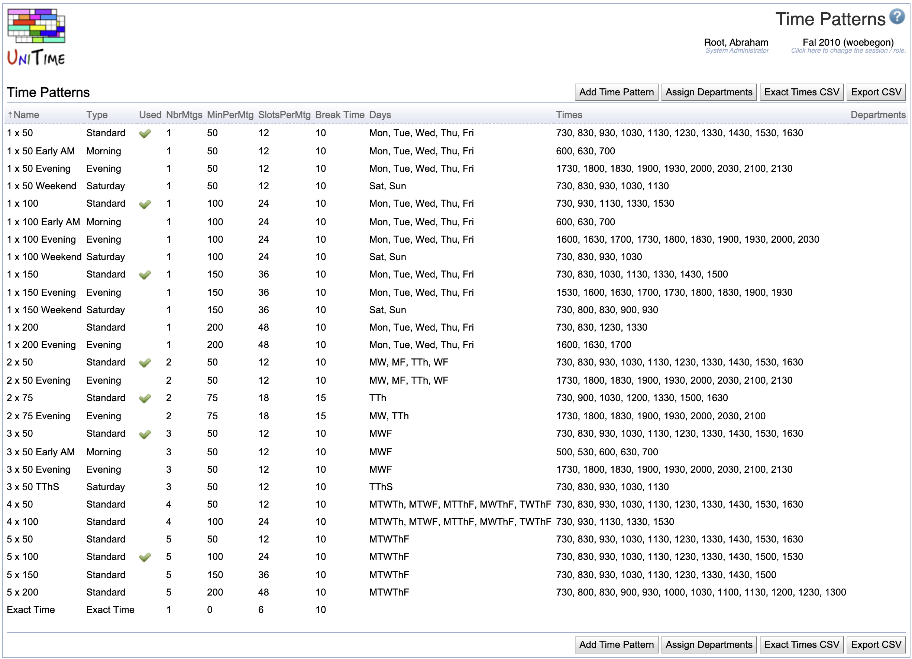

## Screen Description

 The Time Patterns screen provides users with a list of available time patterns.

 A time pattern defines how many times a week a class meets for how many minutes and how much time should be allocated for a break when the class is over.

## Details

 The list of time patterns has the following columns (you can sort by any column by clicking on the column heading in green letters)

* **Name**
	* Name of the time pattern (e.g., 1 x 50)

* **Type**
	* Type of the time pattern (Standard, Evening, Saturday, Morning, Extended, Exact Time)
		* These types may be helpful for organizing the list of time patterns.
			* On classes and scheduling subparts, time patterns are ordered based on these types (Standard time patterns first, then Evening, etc.)
		* If the type is Extended, only explicitly indicated departments (and administrators) have access to this time pattern (this time pattern is not visible as an option on classes and scheduling subparts that are managed by departments not listed on this time pattern)

* **Used**
	* Checked if the time pattern is in use for the term (i.e., a time pattern is selected on at least one class or scheduling subpart)
	* Time patterns that are in use, cannot be deleted and their start times or days cannot be changed. However, the time pattern can be made invisible which will prevent its further use.

* **Number Of Meetings** (NrMtgs)
	* Number of meetings per week (together with MinPerMtg this forms a time pattern; for example, three meetings per week with fifty minutes per meeting form a 3x50 time pattern)

* **Minutes Per Meeting** (MinPerMtg)
	* Number of minuter per each meeting in a week

* **Slots Per Meetings** (SlotsPerMtg)
	* Number of five minute blocks necessary for the meeting
		* The number includes break time after the actual meeting time
		* Examples:
			* If a class meeting lasts 50 minutes and then there should be a 10 minute break, the number of slots is 12
			* If a class meeting lasts 150 minutes but the resources (room, instructor, etc.) need to be reserved for three hours (due to some inner breaks), the number of slots is 36

* **Break time**
	* Indicate how many minutes from the end of the time allocated to the meeting (number of slots x 5) should be reserved for a break (in the example with a 50 minute slot, the break time would be 10 minutes - meaning that the last two slots out of 12 are actually a break time)
	* Resources are allocated for the whole length of the meeting including the break (i.e., for the time indicated by the number of slots per meeting), break time is used to be able to print the correct meeting end time on the schedule (i.e., start time + 5 × slots per meeting - break time [in minutes])

* **Days**
	* List days of week (or combinations of days of week) which should be available for the time pattern
	* For example a 2 × 50 time pattern can meet on the following combinations of days of week:
		* MW ... Monday & Wednesday
		* WF ... Wednesday & Friday
		* TTh ... Tuesday & Thursday
		* MF ... Monday & Friday

* **Times**
	* List possible starting times in military format without separating hours and minutes (for example, "0700", "1530", etc.)
	* For example a 2 × 50 time pattern can start at the following times:
		* 7:30am, 8:30am, 9:30am, 10:30am, 11:30am, 12:30pm, 1:30pm, 2:30pm, 3:30pm, and 4:30pm

* **Departments**
	* If the time pattern is of type Extended, the departments which should have access to this time pattern are listed here

 Click on any time pattern to go to the [Edit Time Pattern](edit-time-pattern) screen.

## Operations

* **Add Time Pattern**
	* Add a new time pattern in the [Add Time Pattern](add-time-pattern) screen

* **Assign Departments**
	* After a roll forward of an academic session, find classes that have an extended time pattern and authorize the departments of these classes to use these time patterns

* **Exact Times CSV**
	* Export a list of classes that are using the "exact time" time pattern into a CSV file that contains the class, the time pattern, and the starting time of the class for each one of them

* **Export CSV**
	* Export the list of time patterns into a CSV file
		* For the time patterns of type Extended, it also exports the first few classes that are using the extended time pattern for each department allowed to use it

{:class='screenshot'}
