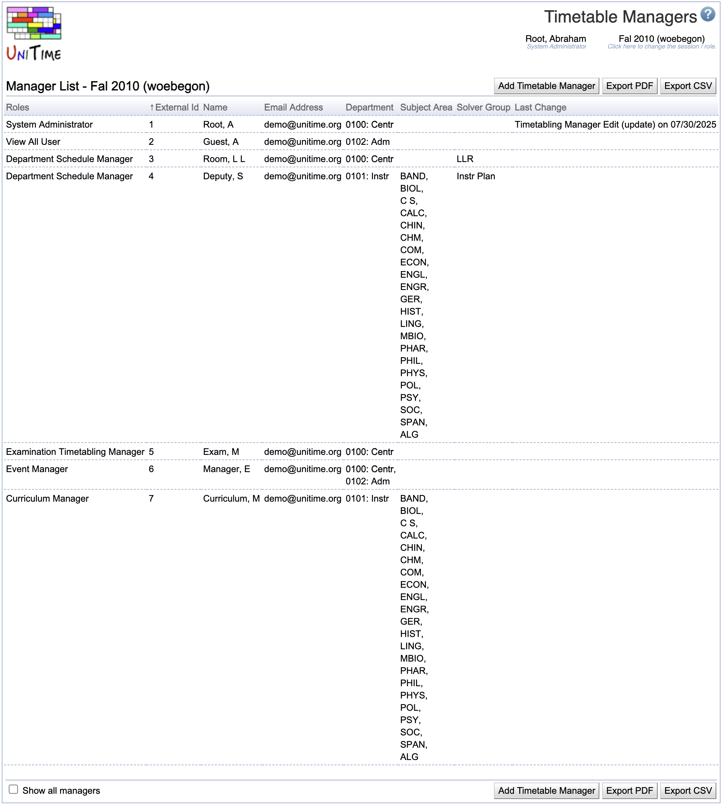

## Screen Description

The Timetable Managers screen contains a list of all users allowed to work with the timetabling application (all managers). The list can be sorted by any column heading in green color. Click on any manager to make changes.

{:class='screenshot'}

## Details

The columns in the list are as follows

* **Roles**
	* Administrator - user who has access to all screens and can do anything
	* Departmental Schedule Manager - user who has access to and can change the input data of certain department(s)
	* External Manager - departmental schedule manager of an external department ("external" is a flag for a departmental schedule manager)
	* View All - user who has access to the (timetabling) data of all departmental schedule managers but cannot make any changes

* **External ID**
	* Manager's (user's) ID

* **Name**
	* User's last and first name and middle initials

* **Email Address**
	* User's email address

* **Department**
	* Department number and abbreviation of departments associated with the manager

* **Subject Area**
	* Subject areas associated with the manager's departments

* **Solver Group**
	* Solver group(s) for which the manager can do timetabling (run the solver etc.)

* **Last Change**
	* Last change made by the manager

Click on a line with a manager to change the values in any of the columns.

## Operations

* **Add Timetable Manager** (ALT+T)
	* Go to the [Add Timetable Manager](add-timetable-manager) screen to add a new manager

* **Export PDF** (ALT+P)
	* Export the list of managers to a PDF document
