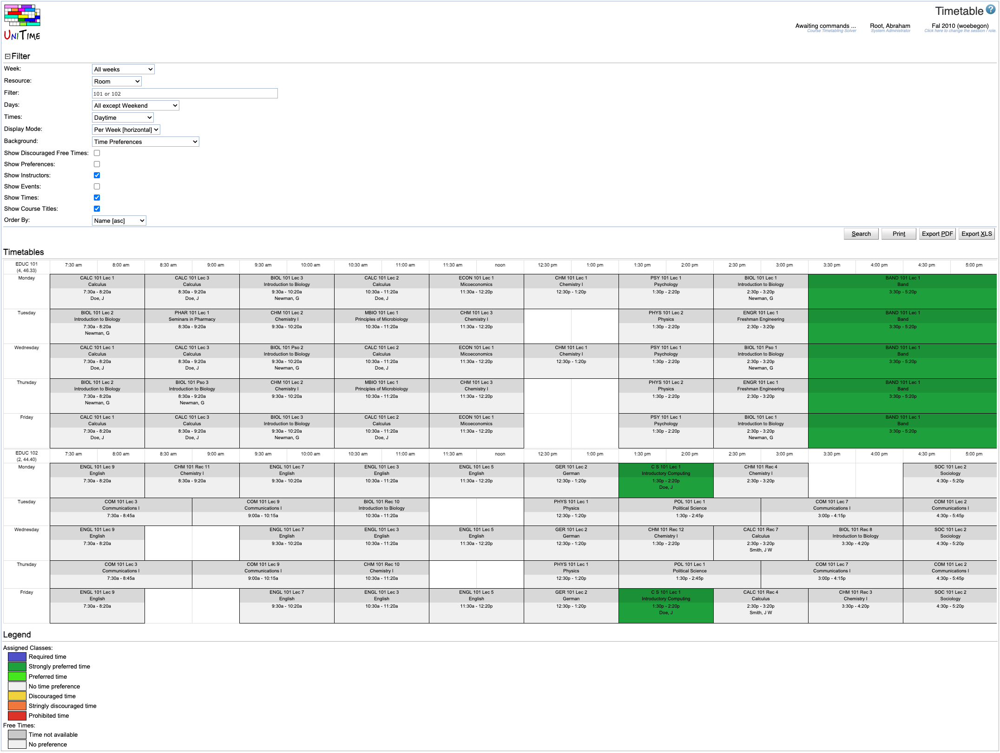

## Screen Description

The Timetable screen offers a view of the (selected/loaded/current) timetable in the form of a time grid organized either by room, by instructor, or by department.

{:class='screenshot'}

## Filter

You can display the time grid in many different ways and filter it by certain parameters.

* **Week**
	* Week(s) for which you want to see the timetable

* **Resource**
	* The resource by which you want to have the timetable organized (Room, Instructor, Department, or Curriculum)
	* The Department option only provides a timetable grid when "departmental balancing" is turned on for the solver configuration with which the timetable has been loaded

* **Filter**
	* Characters by which you want to filter the timetable (such as building abbreviation, room number, or a part of an instructor's name) - the result will be the resource you selected filtered by these characters (so e.g. rooms by building abbreviation or instructors by a part of the name)
	* It is possible to use
	* Boolean queries with "AND", "OR", or "NOT"
		* Note: If there is no special expression, a match is searched for the whole words, not substrings of names etc.
	* "find": to search for substrings
		* Example: "find:AR" to find all rooms that have AR in building or room name (with resource Room)
	* Regular expressions
		* Example: "re:GM.*" to find all rooms in buildings starting with GM (with resource Room)
		* Example: "find:O0 or re:AA.*" to find all rooms that have O0 in the building or room name or that start with AA (with resource Room)
	* "size:" to search for rooms of certain size or size range (for resource Room)
		* Example: "size:>=20 and size:<=50" or "size:20..50"

* A more elaborate example - a room must contain either EDUC or THTR word in the name and it must have less than 20 seats: "(EDUC or THTR) and size:<20"

* **Day**
	* Indicate which days of the week you want to display

* **Daytime/Evening**
	* Indicate which parts of the day you want to display

* **Display Mode**
	* Select the display of the time grid; the options are as follows
		* In Row [horizontal] - Resources on the left, days and times on top (there is a row per resource - e.g. a row per room)
		* Per Week [horizontal] - Days on the left, times on top (a separate grid for each resource)
		* Per Week [vertical] - Days on top, times on the left (a separate grid for each resource)
		* Per Date [horizontal] - Dates on the left, times on top (a separate grid for each resource)

* **Background**
	* Color-coding for the background color of classes in the time grid
		* For example, if you select Time Preference, you will see the color of the time preference originally put on a given class for the assigned time
		* There is always a legend for a given type of background available at the bottom of the Timetable screen

* **Show discouraged free times**
	* By default unchecked
	* If checked, the times will be highlighted which will be difficult to utilize in a given room
		* Example: If there is a class MW 9:30-10:20 in a room, then F 9:30-10:20 will be a discouraged free time since no "regular" class with a standard (MWF) time pattern can meet in this room on F at that time

* **Show preferences**
	* By default unchecked
	* If checked, the differential from the best possible placement for the time preference, student conflict, and room preference values are displayed below the class name in the resulting timetable grid

* **Show instructors**
	* By default unchecked
	* If checked, instructors are displayed for each class (if there is an instructor for that class whose conflicts should be checked during timetabling)

* **Show events**
	* By default unchecked
	* If checked, events in the relevant rooms are displayed in the timetable grid

* **Order By**
	* Choose the order in which the resulting grid(s) will be displayed

To apply the changes you have made to the filter, click on the **Change** button.

## Timetable

The resulting time grid is organized by the selected resource.

For both rooms and instructors, you will see not only the classes from your department, but also any other committed classes that are using this resource. The classes timetabled by other managers will have the background of an unavailable time slot (dark gray).

Roll your mouse over a class to highlight all the parts of that class (for example, roll your mouse over the Monday part and all MWF parts will be highlighted).

Click on any of your classes to go to the [Suggestions](suggestions) screen where you can make changes to the time/room assignment. Note: The timetable has to be loaded for you to be able to make changes.

If "Show Preferences" is checked in the filter, the three comma separated numbers below each class abbreviation indicate the differential from the best possible placement for the time preference, student conflict, and room preference values respectively.

## Operations

* **Change**
	* Apply changes made in the Filter part

* **Export PDF**
	* Export the time grids into a PDF file
		* The time grids are formatted so that they fit pages nicely (they are not e.g. split in half)

* **Refresh**
	* Refresh the time grid
		* This is necessary after you have changed time/room assignment for a class e.g. in the [Suggestions](suggestions) screen
