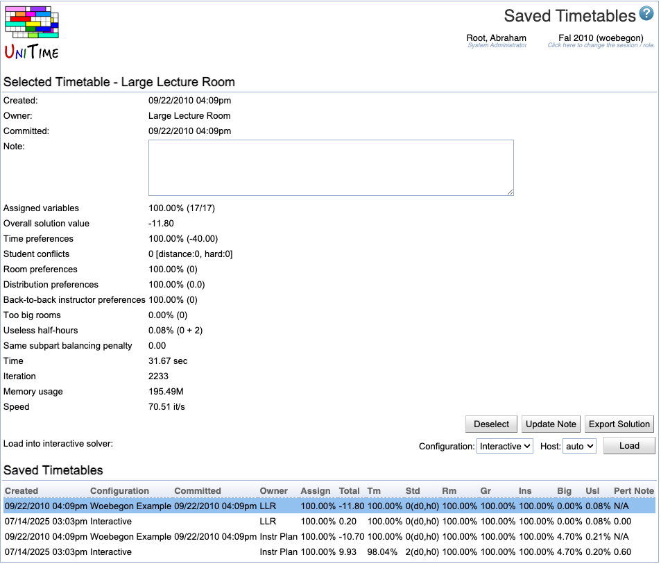

## Screen Description

 The Timetables screen contains information about saved timetables. This page can also be used to select, load, save, commit, uncommit or delete a timetable.

## Saved Timetables

 This section contains a list of saved timetables with their properties. The description of the properties can be found in the [Solution Properties](solution-properties) screen.

 Under the list of saved timetables, there is a line for loading an empty timetable/solution into the interactive solver. The operation is

* **Load Empty Solution**
	* Load input data, but do not do any automatic assignments except for the classes that require a particular room at a particular time - all other classes can be manually assigned by the user. This will normally be used only if you wish to use the interactive solver to manually place all classes.

## Selected Timetable

 To select a timetable, click on the appropriate line in the Saved Timetables table. Once there is a timetable selected, there is a Selected Timetable section present in the **Timetables** screen displaying the properties of the timetable (see [Solution Properties](solution-properties) for the description of these properties) as well as the operations that can be executed on a selected timetable.

### Operations

* **Deselect**
	* Unselect the selected timetable

* **Update Note**
	* Update the Note field

* **Commit**
	* Commit the selected timetable
		* This option is only available (and visible) when the selected timetable is not yet committed and when the user is allowed to commit a solution. Refer to [Status Types](status-types) for more details about which academic session statuses allow users to commit. The status of a particular department can be seen in (and changed from) the [Departments](departments) screen.

* **Uncommit**
	* Uncommit the selected timetable
		* This option is only available (and visible) when the selected timetable is committed and when the user is allowed to uncommit a solution. Refer to [Status Types](status-types) for more details about which academic session statuses allow users to commit. The status of a particular department can be seen in (and changed from) the [Departments](departments) screen.

* **Export Solution**
	* Export the selected timetable as a CSV file (comma separated text file; such file can be easily opened e.g. in Microsoft Excel)
		* Note: Only the classes that are in the timetable are present (i.e., the classes that are managed by the appropriate department and that were loaded into the solver)

* **Delete**
	* Delete the selected timetable
		* If a timetable is committed, it has to be uncommitted before it can be deleted

* **Load**
	* Load the selected timetable into the interactive solver (to load a timetable into the automated solver, see the [Solver](solver) page)
	* One of the interactive solver configurations can be selected prior to loading a solution. For more details, see the [Solver Configurations](solver-configurations) page.
	* Administrators can also select on which solver server the solution will be loaded. For normal users, a solver server is selected automatically (see the [Solver Load Balancing](solver-load-balancing) page for more details).

## Loaded Timetable

 You can load one or more of the saved and selected timetables or an "empty" timetable (in this case, only the classes that require a particular time and room will have those assigned).

### Operations

 The operations available depend on the status of the solver (whether the data is loaded, the solver running, etc.).

	1. While the timetable is loading, the only operation available is
		1. **Refresh**
			* Refresh the **Timetables** screen
	2. When a solution is loaded, the status is changed to Awaiting Commands..., which you can see in the upper right part of the screen (close to the screen name). You can proceed by clicking on the **Refresh** button. Other operations will be available once the solution is loaded:
		1. **Save**
			* Save a solution
				* The solution which was loaded is overwritten; if the loaded solution was committed, it is uncommitted first.
		2. **Save as New**
			* Save a new solution
		3. **Save & Commit**
			* Save and commit a solution
				* The solution which was loaded is overwritten. Any previously committed solutions in the same solver group will be uncommitted.
		4. **Save as New & Commit**
			* Save and commit a new solution. Any previously committed solutions in the same solver group will be uncommitted.
		5. **Reload Input Data**
			* Reload the input data into the solver, keep the existing time and room assignments from the timetable you have been working with
				* This option is particularly handy when you need to reload input data because of some change, but you do not want to loose the changes made in the timetable (alternative way is Save → Unload → Load)
		6. **Unload**
			* Unload the timetable from the solver
				* The solution together with a copy of the input data will no longer be kept in memory of a solver server
				* All unsaved information will be lost

## Notes

* For more details about selected/loaded timetable properties, see [Solution Properties](solution-properties) page.

* For more details about timetable problems, see [Solver Warnings](solver-warnings) page.

* Multiple solutions can be selected at the same time, however, only one solution can be selected from each solver group. If there is already a solution from the given solver group selected, the new solution is selected instead of it (i.e., the previously selected solution is unselected).

* If there is no timetable selected or loaded, Input Data pages (e.g., [Instructional Offerings](instructional-offerings), [Classes](classes), etc.) displays time and room assignments of the committed timetable (if there is any).
	* When there is a solution selected (but no solution is loaded), Input Data pages display time and room assignments of the __selected__ timetable. Also, the assignments of the __selected__ timetable can be seen on pages under **Timetables** (pages [Timetable](timetable), [Assigned](assigned-classes), [Log](solver-log) etc.).
	* When there is a solution loaded, Input Data pages display time and room assignments of the __loaded__ (current) timetable. Also, the assignments of the __loaded__ (current) timetable can be seen on pages under **Timetables**.

{:class='screenshot'}
