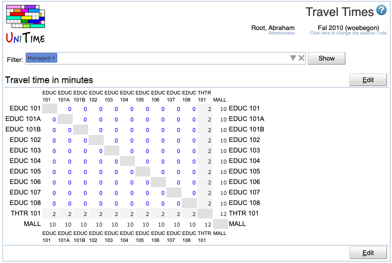
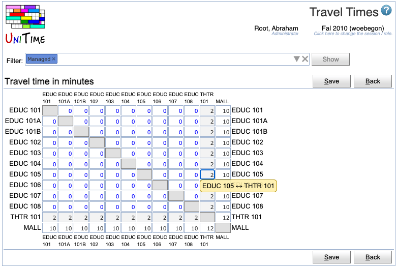

## Screen Description

In the Travel Times screen, you can see and edit the travel time between individual rooms in minutes.

{:class='screenshot'}

## Details

The travel times are pre-populated by the distances computed from room coordinates (default travel times are in blue, modified in black).

Only the rooms meeting the [Filter](events-room-filter) are displayed. The rooms are represented in a matrix, with the number of minutes between individual rooms shown in the appropriate box. 

**Notes:**
 * The page is also limited to 100 rooms.
 * The matrix is symmetrical. When being edited, the other pair gets updated automatically.

## Operations

* **Edit**
    * Make changes in travel times between individual rooms.

{:class='screenshot'}

* **Save**
    * Save changes in the travel times.

* **Back**
    * Go back to the [Travel Times](travel-times) screen without saving any changes
