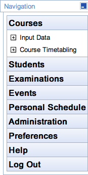
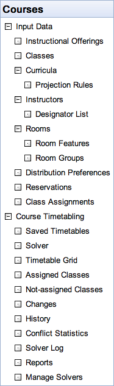
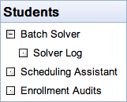
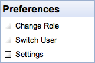
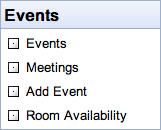
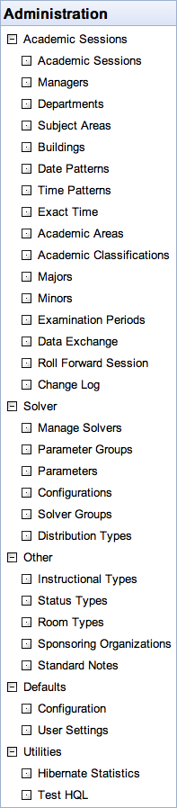
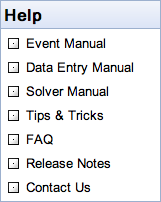

### Table of Contents
{:.no_toc}
* table
{:toc}

{:class='screenshot'}

## Courses

### Input Data
* [Instructional Offerings](instructional-offerings)
	* [Add Course Offering](add-course-offering)
	* [Instructional Offering Detail](instructional-offering-detail)
		* [Instructional Offering Cross Lists](instructional-offering-cross-lists)
		* [Edit Course Offering](edit-course-offering)
		* [Instructional Offering Configuration](instructional-offering-configuration)
		* [Multiple Class Setup](multiple-class-setup)
		* [Assign Instructors](assign-instructors)
		* [Setup Teaching Requests](setup-teaching-requests)
	* [Scheduling Subpart Detail](scheduling-subpart-detail)
		* [Edit Scheduling Subpart](edit-scheduling-subpart)
	* [Class Detail](class-detail)
		* [Edit Class](edit-class)
		* [Class Assignment](class-assignment)
* [Classes](classes)
* [Curricula](curricula)
	* [Curriculum Detail](curriculum-detail)
		* [Edit Curriculum](edit-curriculum)
			* [Course Finder](course-finder)
	* [Add Curriculum](add-curriculum)
	* [Curriculum Requested Enrollments](curriculum-requested-enrollments)
	* [Curriculum Projection Rules](curriculum-projection-rules)
* [Instructors](instructors)
	* [Instructor Detail](instructor-detail)
		* [Edit Instructor](edit-instructor)
			* [People Lookup](people-lookup)
			* [Instructor Preferences](instructor-preferences)
		* [Instructor Assignment Preferences](instructor-assignment-preferences)
	* [Manage Instructor List](manage-instructor-list)
	* [Add Instructor](add-instructor)
* [Instructor Attributes](instructor-attributes)
	* [Add Instructor Attribute](add-instructor-attribute)
	* [Edit Instructor Attribute](edit-instructor-attribute)
* [Instructor Survey](instructor-survey)
* [Rooms](rooms)
	* [Room Detail](room-detail)
		* [Edit Room](edit-room)
	* [Add Room](add-room)
	* [Edit Room Departments](edit-room-departments)
	* [Room Features](room-features)
		* [Add Room Feature](add-room-feature)
		* [Edit Room Feature](edit-room-feature)
		* [Room Groups](room-groups)
			* [Add Room Group](add-room-group)
			* [Edit Room Group](edit-room-group)
* [Distribution Preferences](distribution-preferences)
	* [Add Distribution Preference](add-distribution-preference)
	* [Edit Distribution Preference](edit-distribution-preference)
* [Reservations](reservations)
	* [Add Reservation](add-reservation)
	* [Edit Reservation](edit-reservation)
	* [Class Assignments](class-assignments)
* [Class Assignments](class-assignments)

### Course Timetabling
* [Saved Timetables](timetables)
* [Solver](solver)
* [Timetable Grid](timetable)
* [Suggestions](suggestions)
* [Assigned Classes](assigned-classes)
* [Not-assigned Classes](not-assigned-classes)
* [Changes](changes)
* [History](assignment-history)
* [Conflict Statistics](conflict-based-statistics)
* [Solver Log](solver-log)
* [Reports](solution-reports)

### Instructor Scheduling

* [Instructor Scheduling](instructor-scheduling)
	* [Instructor Scheduling Solver](instructor-scheduling-solver)
	* [Instructor Scheduling Solver Log](instructor-scheduling-solver-log)
	* [Assigned Teaching Requests](assigned-teaching-requests)
		* [Teaching Request Detail](teaching-request-detail)
	* [Not-Assigned Teaching Requests](not-assigned-teaching-requests)
	* [Teaching Assignments](teaching-assignments)
		* [Teaching Assignment Detail](teaching-assignment-detail)
	* [Teaching Assignment Changes](teaching-assignment-changes)
* [Course Reports](course-reports)
* [Point In Time Data Reports](point-in-time-data-reports)

{:class='screenshot'}

## Students
* [Student Scheduling Solver](student-scheduling-solver) 
* [Student Scheduling Solver Log](student-scheduling-solver-log)
* [Batch Student Solver Dashboard](batch-student-solver-dashboard)
	* [Enrollments of Class or Course](enrollments-of-class-or-course)
	* [Classes for Student](classes-for-student)
		* [Change Log](change-log-for-student)
	* [Batch Student Solver Reports](batch-student-solver-reports)
* [Published Schedule Runs](published-schedule-runs)
* [Student Course Requests](student-course-requests)
* [Student Scheduling Assistant](student-scheduling-assistant)
	* [Alternatives](alternatives-for-class)
* [Online Student Scheduling Dashboard](online-student-scheduling-dashboard)
	* [Send Email](send-email)
	* [Mass Cancel](mass-cancel)
	* [Change Message](change-message-for-student)
* [Online Student Scheduling Reports](online-student-scheduling-reports)
* [Enrollment Audit](enrollment-audit-pdf-reports)
* [Advisor Course Recommendations](advisor-course-recommendations) 
* [Student Scheduling Reports](student-scheduling-reports) 

{:class='screenshot'}

## Examinations

### Input Data

* [Instructors](instructors)
* [Rooms](rooms)
	* [Features](room-features)
	* [Groups](room-groups)
	* [Availability](room-availability)
* [Examinations](examinations)
	* [Add Examination](add-examination)
	* [Examination Detail](examination-detail)
		* [Edit Examination](edit-examination)
		* [Examination Assignment](examination-assignment)
* [Distribution Prefs](examination-distribution-preferences)
	* [Add Examination Distribution Preference](add-examination-distribution-preference)
	* [Edit Examination Distribution Preference](edit-examination-distribution-preference)

### Examination Timetabling

* [Examination Solver](examination-solver)
* [Timetable Grid](examination-timetable)
* [Assigned Exams](assigned-examinations)
* [Not-assigned Exams](not-assigned-examinations)
* [Changes](examination-assignment-changes)
* [Conflict Statistics](examination-conflict-based-statistics) Under construction
* [Solver Log](examination-solver-log) Under construction
* [Reports](examination-reports)
* [PDF Reports](examination-pdf-reports)

{:class='screenshot'}

## Events
* [Events](events) ([Room Filter](events-room-filter), [Event Filter](events-event-filter))
	* [Event Detail](event-detail)
		* [Edit Event](edit-event)
		* [Add Event](add-event)
* [Room Availability](event-room-availability)
* [Timetable](event-timetable)

{:class='screenshot'}

## Preferences
* [Change Role](select-academic-session)
* [Switch User](chameleon) (admin)
* [Settings](manager-settings)
	* [Edit Manager Setting](edit-manager-setting)

{:class='screenshot'}

## Administration

### Academic Sessions
* [Academic Sessions](academic-sessions)
	* [Add Academic Session](add-academic-session)
	* [Edit Academic Session](edit-academic-session)
* [Managers](timetable-managers)
	* [Add Timetable Manager](add-timetable-manager)
	* [Edit Timetable Manager](edit-timetable-manager)
* [Departments](departments)
	* [Add Department](add-department)
	* [Edit Department](edit-department)
* [Solver Groups](solver-groups)
	* [Add Solver Group](add-solver-group)
	* [Edit Solver Group](edit-solver-group)
* [Subject Areas](subject-areas)
	* [Add Subject Area](add-subject-area)
	* [Edit Subject Area](edit-subject-area)
	* [Edit Subject Areas](edit-subject-areas)
* [Buildings](buildings)
	* [Add Building](add-building)
	* [Edit Building](edit-building)
* [Date Patterns](date-patterns)
	* [Add Date Pattern](add-date-pattern)
	* [Edit Date Pattern](edit-date-pattern)
* [Time Patterns](time-patterns)
	* [Add Time Pattern](add-time-pattern)
	* [Edit Time Pattern](edit-time-pattern)
* [Exact Time](exact-time-pattern)
* [Academic Areas](academic-areas)
* [Academic Classifications](academic-classifications)
* [Majors](majors)
* [Minors](minors)
* [Student Groups](student-groups)
	* [Add Student Group](add-student-group)
	* [Edit Student Group](edit-student-group)
	* [Edit Student Groups](edit-student-groups)
* [Student Accommodations](student-accommodations)
* [Student Advisors](student-advisors)
* [Examination Periods](examination-periods)
	* [Add Examination Period](add-examination-period)
	* [Edit Examination Period](edit-examination-period)
	* [Setup Examination Periods](setup-examination-periods)
* [Event Date Mappings](event-date-mappings)
* [Event Statuses](event-statuses) (admin, event manager)
	* [Edit Event Status](edit-event-status) (admin, event manager)
	* [Edit Event Statuses](edit-event-statuses) (admin, event manager)
* [Instructor Roles](instructor-roles)
* [Data Exchange](data-exchange)
* [Roll Forward Session](roll-forward-session)
* [Change Log](last-changes)
* [Task Scheduler](task-scheduler)
	* [Task Details](task-details)
* [Reports](administration-reports)
* [Point In Time Data Snapshots](point-in-time-data-snapshots)
	* [Edit Point In Time Data Snapshot](edit-point-in-time-data-snapshot)
	* [Edit Point In Time Data Snapshots](edit-point-in-time-data-snapshots)
* [Limit and Projection Snapshot](limit-and-projection-snapshot)

### Solver
* [Manage Solvers](manage-solvers)
* [Parameter Groups](solver-parameter-groups)
	* [Add Solver Parameter Group](add-solver-parameter-group)
	* [Edit Solver Parameter Group](edit-solver-parameter-group)
* [Parameters](solver-parameters)
	* [Add Solver Parameter](add-solver-parameter)
	* [Edit Solver Parameter](edit-solver-parameter)
* [Configurations](solver-configurations)
	* [Add Solver Configuration](add-solver-configuration)
	* [Edit Solver Configuration](edit-solver-configuration)
* [Distribution Types](distribution-types)
	* [Edit Distribution Type](edit-distribution-type)

### Other
* [Instructional Types](instructional-types)
	* [Add Instructional Type](add-instructional-type)
	* [Edit Instructional Type](edit-instructional-type)
* [Class Duration Types](class-duration-types)
* [Status Types](status-types)
	* [Add Status Type](add-status-type)
	* [Edit Status Type](edit-status-type)
* [Room Types](room-types)
	* [Add Room Type](add-room-type)
	* [Edit Room Type](edit-room-type)
* [Room Feature Types](room-feature-types)
* [Course Types](course-types)
* [Users](users-database-authentication)
	* [Add User](add-user)
	* [Edit User](edit-user)
* [Instructional Methods](instructional-methods)
* [Override Types](override-types)
* [Instructor Attribute Types](instructor-attribute-types)
* [Sponsoring Organizations](sponsoring-organizations)
	* [Add Sponsoring Organization](add-sponsoring-organization)
	* [Edit Sponsoring Organization](edit-sponsoring-organization)
* [Standard Notes](standard-event-notes)
	* [Add Standard Event Note](add-standard-event-note)
	* [Edit Standard Event Note](edit-standard-event-note)
* [Event Service Providers](event-service-providers)
* [Attachment Types](attachment-types)
* [Consent Types](offering-consent-types)
* [Course Credit](course-credit)
* [Course Credit Formats](course-credit-formats)
* [Course Credit Types](course-credit-types)
* [Course Credit Units](course-credit-units)
* [Position Types](position-types)
* [Teaching Responsibilities](teaching-responsibilities)
* [Student Status Types](student-scheduling-status-types)
	* [Add Student Scheduling Status Type](add-student-scheduling-status-type)
	* [Edit Student Scheduling Status Type](edit-student-scheduling-status-type)
	* [Edit Student Scheduling Status Types](edit-student-scheduling-status-types)
* [Student Group Types](student-group-types)
* [Student Scheduling Rules](student-scheduling-rules)
* [Examination Types](examination-types)
* [Roles](roles)
	* [Add Role](add-role)
	* [Edit Role](edit-role)
	* [Edit Roles](edit-roles)
* [Permissions](permissions)
	* [Edit Permission](edit-permission)
	* [Edit Permissions](edit-permissions)

### Defaults

* [Configuration](application-configuration)
	* [Add Application Setting](add-application-setting)
	* [Edit Application Setting](edit-application-setting)
* [User Settings](default-manager-settings)
	* [Add Default Manager Setting](add-default-manager-setting)
	* [Edit Default Manager Setting](edit-default-manager-setting)
* [Logging](logging-levels)

### Utilities

* [Page Statistics](page-statistics)
	* [Hibernate Statistics](hibernate-statistics)
	* [Test HQL](test-hql)
* [Scripts](scripts)

{:class='screenshot'}

## Help
* [Contact Us](contact-us)
* [Tips and Tricks](tips-and-tricks)
* [FAQ](frequently-asked-questions)
* Release Notes
* [Contact Us](contact-us)

{:class='screenshot'}

## Other
* [Examination Timetabling](examination-timetabling)
* Timetables
	* [Examinations](exam-timetable)
	* [Classes](class-timetable)
	* [Personal Timetable](personal-timetable)
* [Types of Distribution Preferences](types-of-distribution-preferences)
* [Structure of Distribution Preferences](structure-of-distribution-preferences)
* Current User
* Solver
	* [Solution Properties](solution-properties)
	* [Class Assignment Properties](class-assignment-properties)
	* [Solver Warnings](solver-warnings)
	* [Solver Status](solver-status)
	* [Examination Solver Status](examination-solver-status)
	* [Application Of Preferences](application-of-preferences)
	* [Student Conflicts](student-conflicts)
* [Timetabling Installation](installation)
* [Timetabling Installation FAQ](timetabling-installation-faq)
* [Customizations](customizations)
* [Localization](localization)
* [LDAP Authentication / Lookup](LDAP)
* [CAS Authentication](CAS)
* [Exam Naming Convention](exam-naming-convention)
* [Custom Room Availability](custom-room-availability)