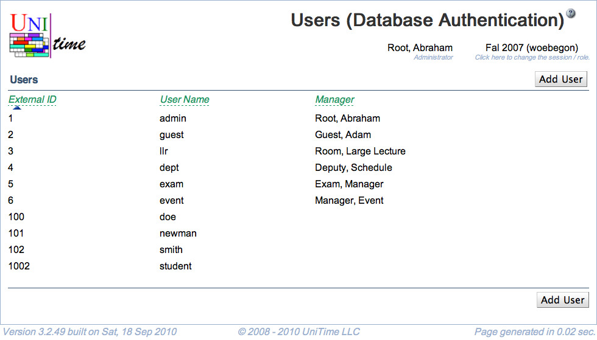

## Screen Description

The Users (Database Authentication) screen provides an overview of users' authentication data in case the timetabling application is not connected to any external database for this purpose.

{:class='screenshot'}

**Hint:** You will be able to enter user's name and other information in the [Add Timetable Manager](add-timetable-manager) screen.

## Details

* **External ID**
	* User's ID to be used in this application (must be unique)

* **User Name**
	* User's login name (must be unique)

* **Manager**
	* User's name as entered in the [Add Timetable Manager](add-timetable-manager) screen

Click on any user in the list to edit his/her authentication data.

## Operations

* **Add User**
	* Add a new user in the [Add User](add-user) screen
