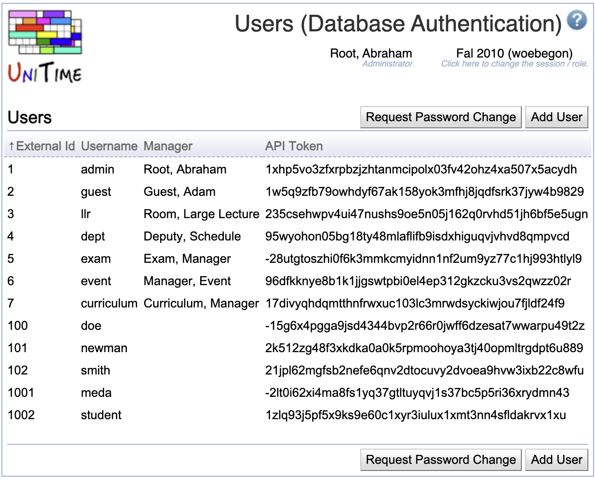
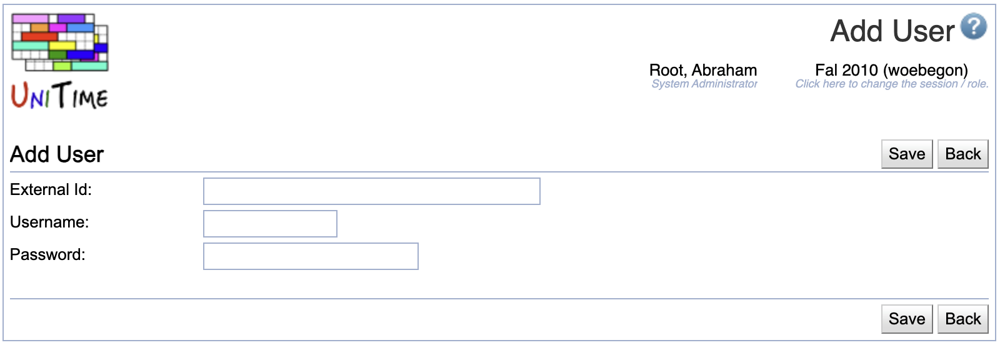
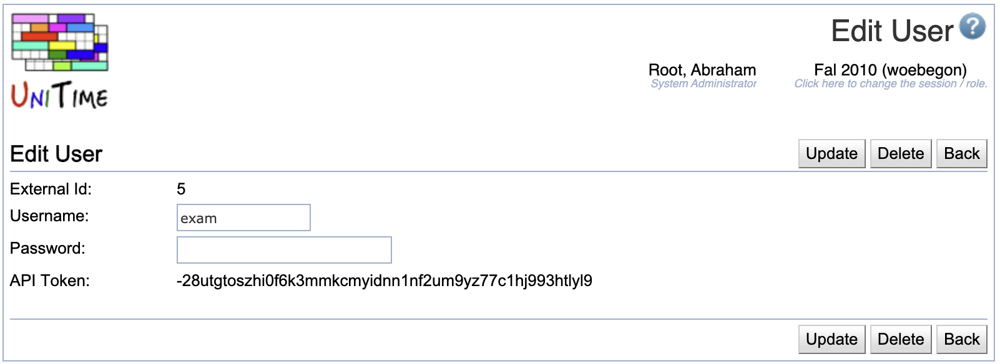

## Screen Description

The Users (Database Authentication) screen provides an overview of users' authentication data in case the timetabling application is not connected to any external database for this purpose.

{:class='screenshot'}

**Hint:** You will be able to enter the user's name and other information in the [Add Timetable Manager](add-timetable-manager) screen.

**Note:** The API Token is only available when the `unitime.api.canUseToken` is set to `true` in the [Application Configuration](application-configuration). See the [API manual](manuals/api) for more details.

## Details

* **External ID**
    * User's ID to be used in this application (must be unique)
    * This ID is matched with other sources to provide the user with the appropriate role(s), such as:
        * [Timetable Managers](timetable-managers) for the manager roles
        * [Instructors](instructors) for the Instructor role
        * [Student Advisors](student-advisors) for the Student Advisor roles
        * Students for the Student role (students are not directly edited in UniTime; they can be imported using the [Data Exchange](data-exchange) page)
        * [Instructor Roles](instructor-roles) for the additional Instructor-related roles

* **User Name**
    * User's login name (must be unique)

* **Manager**
    * Matching manager's name from the [Timetable Managers](timetable-managers) page

## Operations

Click the column header to sort the table by the particular column. The second click on the same column header will reverse the order.

Click **Request Password Change** to open the [Password](password#request-password) page, which can be used to email a user with a link to reset their password.

### Add User

Click **Add User** to create a new user.

{:class='screenshot'}

* Click **Save** to save this new user's authentication data and go back to the list of users
* Click **Back** to go back to the list of users without making any changes

### Edit User
Click on any user in the list to edit their authentication data.

{:class='screenshot'}

The password is only updated when a new password is filled in (no password change when the Password field is left empty).

* Click **Update** to save changes and go back to the list of users
* Click **Delete** to delete the user's authentication data
* Click **Back** to go back to the list of users without making any changes

**Note:** The API Token is generated using both username and password. Changing the password will change the API Token.