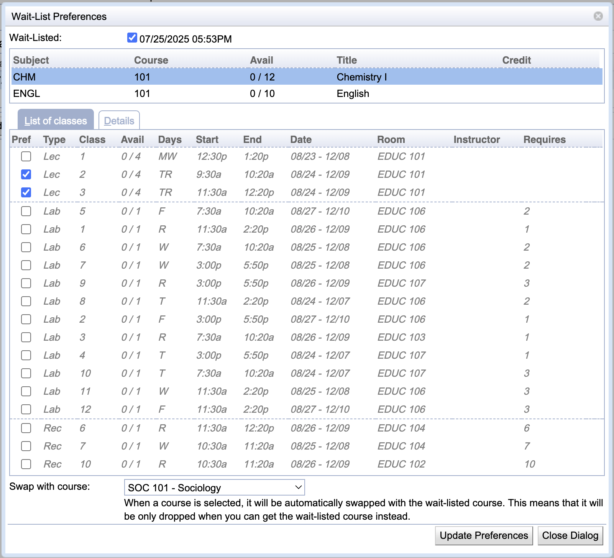

## Screen Description

The Wait-List Preferences dialog offers the ability to set section and/or instructional method preferences for a course that is to be wait-listed. It is opened from the [Student Scheduling Assistant](student-scheduling-assistant) when a wait-listed course is clicked from the **Class Schedule**.

{:class='screenshot'}

## Details

The **Wait-Listed** toggle can be unchecked to stop wait-listing the course. If the course is already wait-listed, the date and time when it was wait-listed initially are displayed next to the toggle.

The table displays the wait-listed course, as well as its alternatives, if any were provided in the **Course Requests** section of the [Student Scheduling Assistant](student-scheduling-assistant). Click on the alternative course to set section and/or instructional method preferences for the alternative.

Below the course table, section, and/or instructional method preferences can be provided by checking the appropriate toggles. The student can only be registered in enrollments containing the selection. So, for instance, if a Lecture is selected, the student can only be enrolled in valid enrollments containing that lecture (it is not necessary to select the other components).

The **Swap with course** drop-down can be used to indicate a swap. That is when space becomes available for the student in the wait-listed course (or one of its alternatives), the student is enrolled in the wait-listed course together, while they are also removed from the selected course. Only courses for which the student is currently enrolled are available. Select the same course as the one that is being wait-listed to wait-list for a different section (or sections) of a course that is already enrolled.

### Operations

Click **Update Preferences** to make the changes. Please note that no changes are actually made until the **Submit Schedule** button is clicked on the [Student Scheduling Assistant](student-scheduling-assistant) page.

Click **Close Dialog** to close the dialog without making any changes.